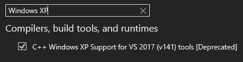

# Cave Story Mod Loader example mod
This is an example mod that can be compiled using Visual Studio 2022 for making dll mods for Cave Story freeware, using [Clownacy's Mod Loader](https://github.com/Clownacy/Cave-Story-Mod-Loader/releases).

You'll first need a copy of [Visual Studio 2022](https://visualstudio.microsoft.com/downloads/). When you're installing it, go to the individual components tab and select the "C++ Windows XP Support for VS 2017 (v141) tools [Deprecated]".

If you already have Visual Studio 2022, search your computer for "Visual Studio Installer", and click modify on Visual Studio 2022. Go to the invididual components tab, and select the "C++ Windows XP Support for VS 2017 (v141) tools [Deprecated]" like shown above.

After that's all installed, you should be able to just compile the dll using the mod.sln file, and test it just by opening the game.

Note that anyone who plays mods using your dll should install the latest [vc_redist](https://aka.ms/vs/17/release/vc_redist.x86.exe) for x86 if they do not have it. It has to be x86, even if your computer is x64.
